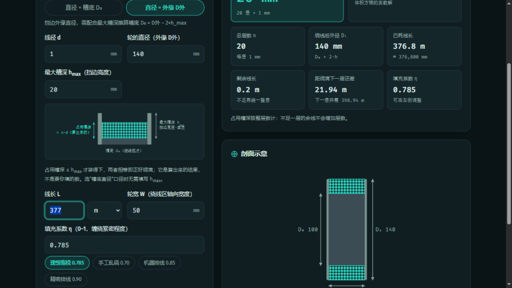

# 绕线计算器

一个零依赖的单页计算器：**线往轮子上缠，能缠多长？** 或者反过来——**一卷线缠上去，会占多深的槽？**

基于分层密绕模型推导（等差数列求和 + 体积法交叉验证），内置浮点安全取整，双主题，纯本地运行。

<p align="center">
  
  
</p>
<p align="center">
  
</p>

## 功能特性

- **双模式互算**
  - 正算：由线径、轮直径、槽深、轮宽 → 可绕线长（含理想密绕与按填充系数 η 的工程估算）
  - 反算：由线长、线径、轮直径、轮宽 → 占用槽深（按整层数计），并给出剩余线长、距绕满下一层还差多少
- **直径口径可选**：轮的直径可指定为**槽底 D₀** 或**外缘 D外**（外缘口径自动按 D₀ = D外 − 2×槽深 换算；反算模式下会引导补充"最大槽深"并用示意图解释两个"槽深"的区别）
- **填充系数 η 可调**：预设理想密绕 0.785 / 手工乱绕 0.70 / 机器排线 0.85 / 精密排线 0.90，也可手填
- **浮点精度安全**：线径为毫米浮点数（如 0.3），直接 `⌊0.9/0.3⌋` 会因二进制误差得到 2 而非 3；取整前先按 12 位有效数字规整，杜绝少算一层
- **SVG 剖面实时可视化**：线圈截面、槽底/挡边、D₀/D₁/W 动态尺寸标注，绕出挡边时橙色虚线警示
- **深浅色主题**：跟随系统偏好，手动切换并记忆
- **无障碍与响应式**：键盘可达、焦点环、`aria-live` 结果播报；375px 手机 → 2K 宽屏均自适应
- **输入记忆**：参数自动存入 localStorage，下次打开自动恢复

## 数学模型

线一圈一层并排密绕，每层匝数与层数向下取整：

| 量 | 公式 |
|---|---|
| 每层匝数 | N = ⌊W / d⌋ |
| 层数 | n = ⌊h / d⌋ |
| 理想密绕线长 | L = π · N · n · (D₀ + n·d) |
| 工程估算（含填充系数） | L = 4η · W · h · (D₀ + h) / d² |
| 反算（解二次方程取整层） | h² + D₀·h − L·d²/(4ηW) = 0 |

- 理想密绕对应 η = π/4 ≈ 0.785（圆的方形排列密度），两种推导互相印证；
- 等圆堆积理论极限为 π/√12 ≈ 0.907（Thue 定理）；
- 每匝实为螺旋线，长度修正量为 O((d/2πr)²)，百万分之几，可忽略。

完整推导过程（建模、等差数列求和、体积法验证、修正项讨论、数值算例）见 [docs/绕线长度计算.md](docs/绕线长度计算.md)。

## 快速开始

无需构建、无需联网，三种方式任选：

```text
1. 双击 index.html                          —— 直接用（file:// 下同样工作）
2. 双击 启动计算器.bat                       —— 起本地服务并自动打开浏览器（需 Python 3）
3. python -m http.server 8741               —— 手动起服务后访问 http://127.0.0.1:8741/
```

## 运行测试

数学核心（`app.js` 中的 `MathCore`）与页面逻辑解耦，可在 Node 中直接测试：

```bash
node test.js
```

36 个用例覆盖：文档算例回代（377 m）、浮点精度（`0.9/0.3`、49.999…97）、外缘/槽底口径一致性、正反算往返、容量溢出告警、闭式解与暴力搜索一致性、边界与非法输入。

## 项目结构

```text
winding-calculator/
├── index.html            # 页面结构 + SVG 剖面 + 公式折叠区
├── styles.css            # 设计令牌、深浅色主题、响应式
├── app.js                # MathCore 数学核心 + 页面逻辑 + 可视化
├── test.js               # 36 项单元测试（node test.js）
├── 启动计算器.bat         # Windows 一键启动（GBK 编码，双击即用）
├── docs/
│   └── 绕线长度计算.md    # 完整数学推导
└── screenshots/          # README 截图
```

## 版本

- **v1.0.0**（2026-09-07）：首个正式版——正反算双模式、口径切换、浮点安全取整、η 预设、SVG 剖面、深浅色、响应式。
